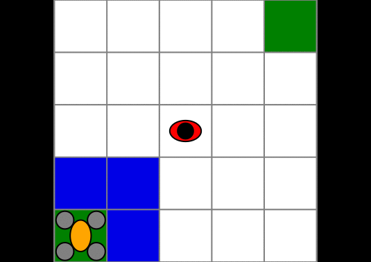
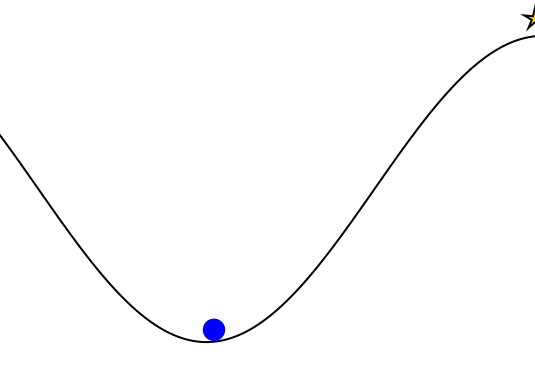
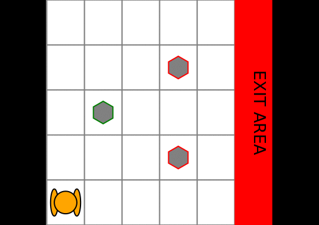

# POMDPGallery

[](https://travis-ci.org/JuliaPOMDP/POMDPGallery.jl)

A gallery of models written for [POMDPs.jl](https://github.com/JuliaPOMDP/POMDPs.jl) with visualizations. You should be able to copy and paste the code below each visualization to run it on your local machine.

For instructions on how to add new models, see [INSTRUCTIONS.md](INSTRUCTIONS.md).

For the older version of this package with julia-0.6 models, see [this branch](https://github.com/JuliaPOMDP/POMDPGallery.jl/tree/julia-0.6).
## [ContinuumWorld](https://github.com/zsunberg/ContinuumWorld.jl)

A Continuous 2D MDP domain for demonstrating function approximation value iteration.


```julia
using ContinuumWorld
using POMDPs
using GridInterpolations
using Reel
using Plots;        pyplot()

w = CWorld()

nx = 30; ny = 30
grid = RectangleGrid(range(first(w.xlim), stop=last(w.xlim), length=nx), 
                     range(first(w.ylim), stop=last(w.ylim), length=ny))
solver = CWorldSolver(max_iters=30, m=50, grid=grid)
policy = solve(solver, w)

frames = Frames(MIME("image/png"), fps=4)
for i in 1:length(solver.value_hist)
    v = solver.value_hist[i]
    push!(frames, CWorldVis(w, f=s->evaluate(v,s), g=solver.grid, title="Value iteration step $i"))
    print(".")
end
for i in 1:10
    push!(frames, CWorldVis(w, f=s->action_ind(policy, s), g=solver.grid, title="Policy"))
    print(".")
end
println()
write("out.gif", frames)
```


## [DroneSurveillance](https://github.com/JuliaPOMDP/DroneSurveillance.jl)

Implementation of a drone surveillance POMDP from M. Svoreňová, M. Chmelík, K. Leahy, H. F. Eniser, K. Chatterjee, I. Černá, C. Belta, " Temporal logic motion planning using POMDPs with parity objectives: case study paper", International Conference on Hybrid Systems: Computation and Control (HSCC), 2015.
The UAV must go from one corner to the other while avoiding a ground agent. It can only detect the ground agent within its field of view (in blue).



```julia
using DroneSurveillance
using POMDPs
# import a solver from POMDPs.jl e.g. SARSOP
using SARSOP
# for visualization
using POMDPGifs
import Cairo, Fontconfig

pomdp = DroneSurveillancePOMDP() # initialize the problem 
solver = SARSOPSolver(precision=0.1, timeout=10.0) # configure the solver
policy = solve(solver, pomdp) # solve the problem

sim = GifSimulator(filename="out.gif", max_steps=30)
simulate(sim, pomdp, policy);
```


## [EscapeRoomba](https://github.com/sisl/AA228FinalProject)

The optional final project for AA228 at Stanford in Fall 2018. A Roomba equipped with a LIDAR or a bump sensor (shown) needs to try to find the safe exit (green) without accidentally falling down the stairs (red).


```julia
using AA228FinalProject
using POMDPGifs
using Random
using ParticleFilters
using POMDPPolicies
using ARDESPOT
using POMDPs

rng = MersenneTwister(2)
speed = 2.0
as = vec([RoombaAct(v, om) for v in (0.0, speed), om in (-1.0, 0.0, 1.0)])
m = RoombaPOMDP(sensor=Bumper(), mdp=RoombaMDP(config=1, aspace=as, contact_pen=-0.1));

default = FunctionPolicy(x->[speed, 0.0])
bounds = IndependentBounds(DefaultPolicyLB(default), 10.0, check_terminal=true)
solver = DESPOTSolver(K=20, T_max=1.0, bounds=bounds, rng=rng)
planner = solve(solver, m)

spf = SimpleParticleFilter(m, BumperResampler(5000), rng=rng)
filter = RoombaParticleFilter(spf, 2.0, 0.5);

makegif(m, planner, filter, filename="out.gif", rng=rng, max_steps=100, show_progress=true)
```


## [LaserTag](https://github.com/JuliaPOMDP/LaserTag.jl)

LaserTag problem from Somani, A., Ye, N., Hsu, D., & Lee, W. (2013). DESPOT : Online POMDP Planning with Regularization. Advances in Neural Information Processing Systems. Retrieved from http://papers.nips.cc/paper/5189-despot-online-pomdp-planning-with-regularization. Versions with continuous and discrete observations.


```julia
using LaserTag
using POMDPGifs
using QMDP
using Random
using ParticleFilters

rng = MersenneTwister(7)

m = gen_lasertag(rng=rng, robot_position_known=true)
policy = solve(QMDPSolver(verbose=true), m)
filter = SIRParticleFilter(m, 10000, rng=rng)

@show makegif(m, policy, filter, filename="out.gif", rng=rng)
```


## [QuickMountainCar](https://github.com/JuliaPOMDP/QuickPOMDPs.jl)

An implementation of the classic Mountain Car RL problem using the QuickPOMDPs interface.




```julia
using POMDPs
using QuickPOMDPs
using POMDPPolicies
using Compose
import Cairo
using POMDPGifs

mountaincar = QuickMDP(
    function (s, a, rng)        
        x, v = s
        vp = clamp(v + a*0.001 + cos(3*x)*-0.0025, -0.07, 0.07)
        xp = x + vp
        if xp > 0.5
            r = 100.0
        else
            r = -1.0
        end
        return (sp=(xp, vp), r=r)
    end,
    actions = [-1., 0., 1.],
    initialstate = (-0.5, 0.0),
    discount = 0.95,
    isterminal = s -> s[1] > 0.5,

    render = function (step)
        cx = step.s[1]
        cy = 0.45*sin(3*cx)+0.5
        car = (context(), circle(cx, cy+0.035, 0.035), fill("blue"))
        track = (context(), line([(x, 0.45*sin(3*x)+0.5) for x in -1.2:0.01:0.6]), stroke("black"))
        goal = (context(), star(0.5, 1.0, -0.035, 5), fill("gold"), stroke("black"))
        bg = (context(), rectangle(), fill("white"))
        ctx = context(0.7, 0.05, 0.6, 0.9, mirror=Mirror(0, 0, 0.5))
        return compose(context(), (ctx, car, track, goal), bg)
    end
)

energize = FunctionPolicy(s->s[2] < 0.0 ? -1.0 : 1.0)
makegif(mountaincar, energize; filename="out.gif", fps=20)
```


## [RockSample](https://github.com/JuliaPOMDP/RockSample.jl)

Rock sample problem from T. Smith, R. Simmons, "Heuristic Search Value Iteration for POMDPs," in Association for Uncertainty in Artificial Intelligence (UAI), 2004. 
A Rover must pick up good rocks in a grid world. It knows the location of the rocks but does not know which one is good or bad. It is equipped with a noisy sensor to detect the status of a rock.



```julia
using POMDPs
using RockSample 
using SARSOP # load a  POMDP Solver
using POMDPGifs # to make gifs
import Cairo, Fontconfig

pomdp = RockSamplePOMDP(rocks_positions=[(2,3), (4,4), (4,2)], 
                        sensor_efficiency=10.0,
                        discount_factor=0.95, 
                        good_rock_reward = 20.0)

solver = SARSOPSolver(precision=1e-3)

policy = solve(solver, pomdp)

sim = GifSimulator(filename="out.gif", max_steps=30)
simulate(sim, pomdp, policy);
```


## [VDPTag2](https://github.com/zsunberg/VDPTag2.jl)

An implimentation of Van Der Pol Tag using POMDPs.jl and POMCPOW. 


```julia
using VDPTag2
using Plots
using Reel
using ProgressMeter
using ParticleFilters
using StaticArrays
using POMDPs
using Random
using POMDPModelTools
using POMDPPolicies
using POMDPModels
using POMDPSimulators

frames = Frames(MIME("image/png"), fps=2)

# pomdp = VDPTagPOMDP()
pomdp = VDPTagPOMDP(mdp=VDPTagMDP(barriers=CardinalBarriers(0.2, 2.8)))
policy = ManageUncertainty(pomdp, 0.01)
# policy = ToNextML(mdp(pomdp))

rng = MersenneTwister(5)

hr = HistoryRecorder(max_steps=30, rng=rng)
filter = SIRParticleFilter(pomdp, 200, rng=rng)
hist = POMDPs.simulate(hr, pomdp, policy, filter)

gr()
@showprogress "Creating gif..." for i in 1:n_steps(hist)
    push!(frames, plot(pomdp, view(hist, 1:i)))
end

filename = string("_vdprun.gif")
write(filename, frames)
println(String(pwd()) * "/" * filename)
```


