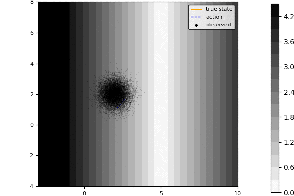
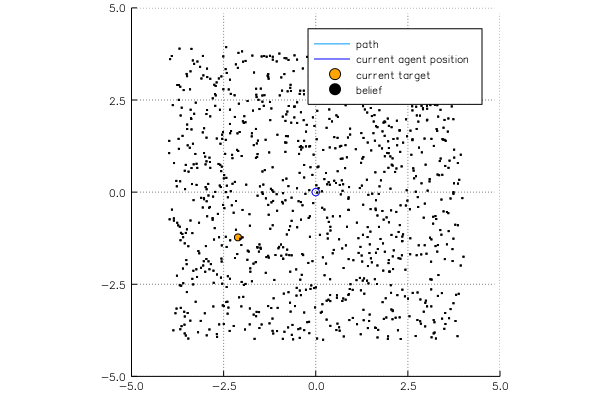

# POMDPGallery

A gallery of models written for [POMDPs.jl](https://github.com/JuliaPOMDP/POMDPs.jl) with visualizations.

For instructions on how to add new models, see [INSTRUCTIONS.md](INSTRUCTIONS.md).

## [LaserTag](https://github.com/zsunberg/LaserTag.jl)

LaserTag problem from Somani, A., Ye, N., Hsu, D., & Lee, W. (2013). DESPOT : Online POMDP Planning with Regularization. Advances in Neural Information Processing Systems. Retrieved from http://papers.nips.cc/paper/5189-despot-online-pomdp-planning-with-regularization. Versions with continuous and discrete observations.


```julia
try Pkg.clone("https://github.com/zsunberg/LaserTag.jl.git") end
Pkg.build("LaserTag")
Pkg.add("Reel")

using POMDPs
POMDPs.add("QMDP")

using LaserTag
using POMDPToolbox
using ParticleFilters
using QMDP

using Reel

rng = MersenneTwister(7)
pomdp = gen_lasertag(rng=rng)
policy = solve(QMDPSolver(), pomdp)
filter = SIRParticleFilter(pomdp, 10000)

frames = Frames(MIME("image/png"), fps=2)

print("Simulating and generating LaserTag gif")
for step in stepthrough(pomdp, policy, filter, "a,r,sp,o,bp", rng=rng)
    push!(frames, LaserTagVis(pomdp, step...))
    print('.')
end
println(" Done.")
write("out.gif", frames)
```


## [LightDarkPOMDPs](https://github.com/zsunberg/LightDarkPOMDPs.jl)

A 2D LightDark POMDP similar to the one at http://www.roboticsproceedings.org/rss06/p37.pdf . There is a version with a quadratic cost function, and one with a small target.




```julia
try Pkg.clone("https://github.com/zsunberg/LightDarkPOMDPs.jl") end
Pkg.build("LightDarkPOMDPs")
using POMDPs
using LightDarkPOMDPs

Pkg.add("Reel");            using Reel
Pkg.add("POMDPToolbox");    using POMDPToolbox
Pkg.add("ParticleFilters"); using ParticleFilters
Pkg.add("Plots");           using Plots
Pkg.add("PyPlot")

pomdp = LightDark2D()
filter = SIRParticleFilter(pomdp, 10000, rng=MersenneTwister(5))
policy = FunctionPolicy(b -> -0.3*mean(b))

sim = HistoryRecorder(max_steps=30, rng=MersenneTwister(7))
hist = simulate(sim, pomdp, policy, filter)

pyplot()
frames = Frames(MIME("image/png"), fps=2)
for i in 1:length(hist)
    v = view(hist, 1:i)
    plot(pomdp, xlim=(-3, 10), ylim=(-4,8), aspect_ratio=:equal)
    plot!(v)
    b = belief_hist(v)[end]
    plt = plot!(b)
    push!(frames, plt);
    print(".")
end
println()
write("out.gif", frames);
```


## [VDPTag](https://github.com/zsunberg/VDPTag.jl)

Van Der Pol Tag. The agent tries to catch a target that moves according to the [Van Der Pol equations](https://en.wikipedia.org/wiki/Van_der_Pol_oscillator#Two-dimensional_form). An observation with a noisy bearing to the target can be obtained for a cost, and the agent always moves one unit, but may choose any direction.




```julia
try Pkg.clone("https://github.com/zsunberg/VDPTag.jl") end
using POMDPs
Pkg.build("VDPTag");        using VDPTag
Pkg.add("Reel");            using Reel
Pkg.add("Plots");           using Plots
Pkg.add("GR");              
Pkg.add("ParticleFilters"); using ParticleFilters
Pkg.add("ProgressMeter");   using ProgressMeter
Pkg.add("POMDPToolbox");    using POMDPToolbox
Pkg.add("Distributions");   using Distributions

pomdp = VDPTagPOMDP()
filter = SIRParticleFilter(pomdp, 1000, rng=MersenneTwister(100))

hist = sim(pomdp, updater=filter, max_steps=100, rng=MersenneTwister(1)) do b
    # Policy: move towards predicted target position; if uncertainty > 0.01, take measurement
    agent = first(particles(b)).agent
    target_particles = Array(Float64, 2, n_particles(b))
    for (i, s) in enumerate(particles(b))
        target_particles[:,i] = s.target
    end
    normal_dist = fit(MvNormal, target_particles)
    angle = action(ToNextML(mdp(pomdp)), TagState(agent, mean(normal_dist)))
    a = TagAction(sqrt(det(cov(normal_dist))) > 0.01, angle)
    return a
end

gr()
frames = Frames(MIME("image/png"), fps=2)
@showprogress "Creating gif..." for i in 1:length(hist)
    push!(frames, plot(pomdp, view(hist, 1:i)))
end
write("out.gif", frames)
```


