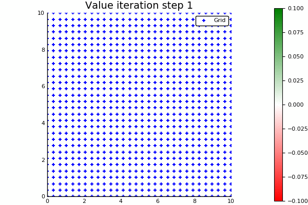
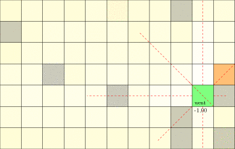

# POMDPGallery

[](https://travis-ci.org/JuliaPOMDP/POMDPGallery.jl)

A gallery of models written for [POMDPs.jl](https://github.com/JuliaPOMDP/POMDPs.jl) with visualizations. You should be able to copy and paste the code below each visualization to run it on your local machine.

For instructions on how to add new models, see [INSTRUCTIONS.md](INSTRUCTIONS.md).

For the older version of this package with julia-0.6 models, see [this branch](https://github.com/JuliaPOMDP/POMDPGallery.jl/tree/julia-0.6).
## [ContinuumWorld](https://github.com/zsunberg/ContinuumWorld.jl)

A Continuous 2D MDP domain for demonstrating function approximation value iteration.




```julia
using ContinuumWorld
using POMDPs
using GridInterpolations
using Reel
using Plots;        pyplot()

w = CWorld()

nx = 30; ny = 30
grid = RectangleGrid(range(first(w.xlim), stop=last(w.xlim), length=nx), 
                     range(first(w.ylim), stop=last(w.ylim), length=ny))
solver = CWorldSolver(max_iters=30, m=50, grid=grid)
policy = solve(solver, w)

frames = Frames(MIME("image/png"), fps=4)
for i in 1:length(solver.value_hist)
    v = solver.value_hist[i]
    push!(frames, CWorldVis(w, f=s->evaluate(v,s), g=solver.grid, title="Value iteration step $i"))
    print(".")
end
for i in 1:10
    push!(frames, CWorldVis(w, f=s->action_ind(policy, s), g=solver.grid, title="Policy"))
    print(".")
end
println()
write("out.gif", frames)
```


## [EscapeRoomba](https://github.com/sisl/AA228FinalProject)

The optional final project for AA228 at Stanford in Fall 2018. A Roomba equipped with a LIDAR or a bump sensor (shown) needs to try to find the safe exit (green) without accidentally falling down the stairs (red).


```julia
using AA228FinalProject
using POMDPGifs
using Random
using ParticleFilters
using POMDPPolicies
using ARDESPOT
using POMDPs

rng = MersenneTwister(2)
speed = 2.0
as = vec([RoombaAct(v, om) for v in (0.0, speed), om in (-1.0, 0.0, 1.0)])
m = RoombaPOMDP(sensor=Bumper(), mdp=RoombaMDP(config=1, aspace=as, contact_pen=-0.1));

default = FunctionPolicy(x->[speed, 0.0])
bounds = IndependentBounds(DefaultPolicyLB(default), 10.0, check_terminal=true)
solver = DESPOTSolver(K=20, T_max=1.0, bounds=bounds, rng=rng)
planner = solve(solver, m)

spf = SimpleParticleFilter(m, BumperResampler(5000), rng=rng)
filter = RoombaParticleFilter(spf, 2.0, 0.5);

makegif(m, planner, filter, filename="out.gif", rng=rng, max_steps=100, show_progress=true)
```


## [LaserTag](https://github.com/JuliaPOMDP/LaserTag.jl)

LaserTag problem from Somani, A., Ye, N., Hsu, D., & Lee, W. (2013). DESPOT : Online POMDP Planning with Regularization. Advances in Neural Information Processing Systems. Retrieved from http://papers.nips.cc/paper/5189-despot-online-pomdp-planning-with-regularization. Versions with continuous and discrete observations.




```julia
using LaserTag
using POMDPGifs
using QMDP
using Random
using ParticleFilters

rng = MersenneTwister(7)

m = gen_lasertag(rng=rng, robot_position_known=true)
policy = solve(QMDPSolver(verbose=true), m)
filter = SIRParticleFilter(m, 10000, rng=rng)

@show makegif(m, policy, filter, filename="out.gif", rng=rng)
```


